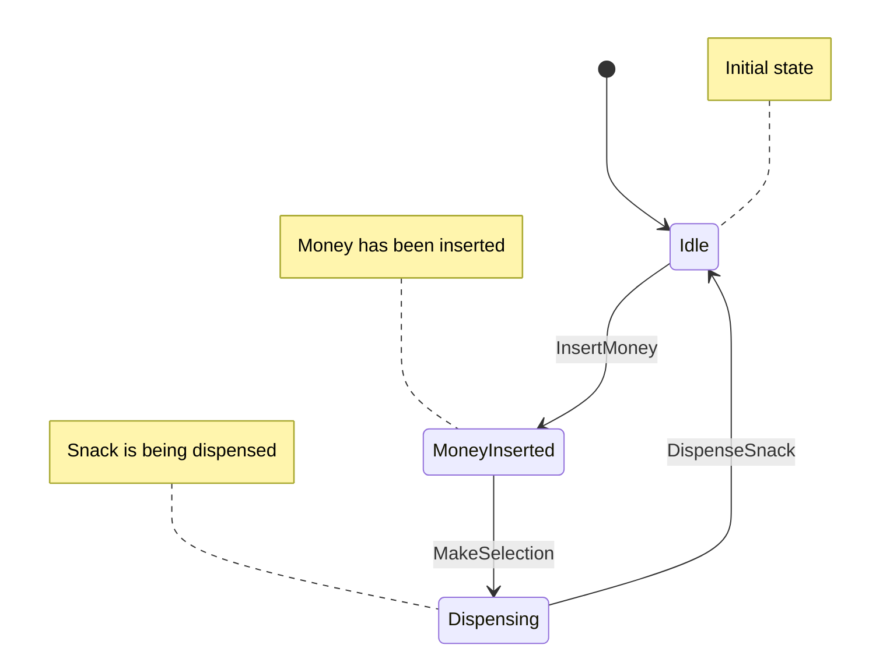

### State Pattern

Let's say you're working on a vending machine that sells snacks. The vending machine has several states, such as:

- Idle state: The vending machine is waiting for a customer to insert money or make a selection.
- Money inserted state: The vending machine has received money from the customer and is waiting for the customer to make a selection.
- Dispensing state: The vending machine is dispensing the selected snack.
- Out of stock state: The vending machine is out of the selected snack and cannot dispense it.

To implement the state pattern for this vending machine:

- Define an interface for the vending machine states. This interface should define the methods that the vending machine can use to interact with each state. For example, the interface might include methods like "insertMoney", "makeSelection", and "dispenseSnack".

- Create a class for each vending machine state that implements the interface. Each class should have its own implementation of the methods defined in the interface.

- Define a context class for the vending machine that holds the current state and delegates method calls to the current state. For example, the context class might have a method like "insertMoney" that calls the "insertMoney" method on the current state.

- Create instances of the state classes and set the initial state of the vending machine to the idle state.

- Test the vending machine by calling methods on the context object and verifying that the correct state is being used for each operation. For example, if the vending machine is in the idle state and the customer inserts money, the vending machine should transition to the money inserted state.