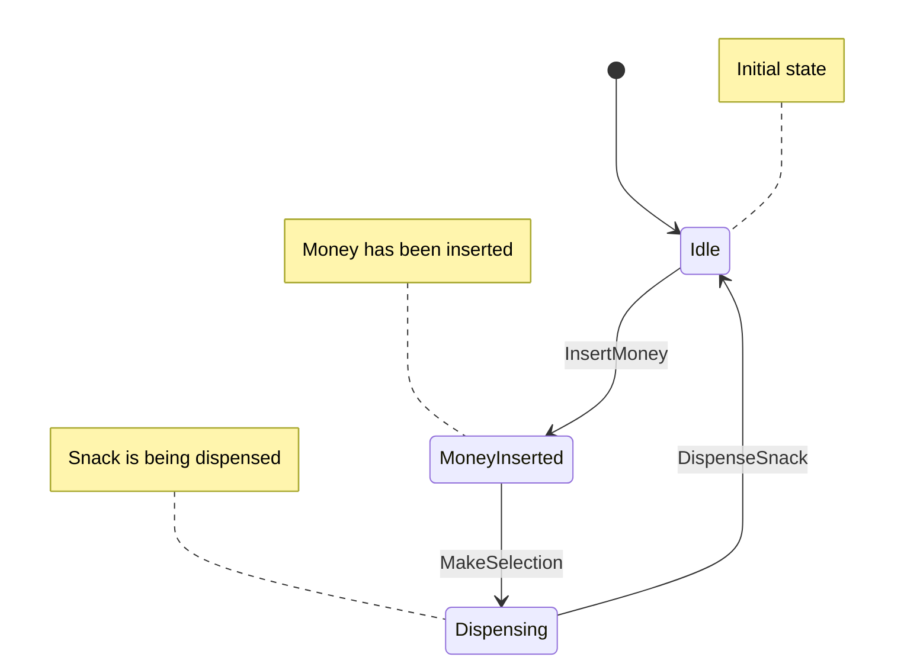

### State Pattern

The code implements a vending machine functionality based on 

```mermaid
stateDiagram-v2
    [*] --> Idle
    Idle --> MoneyInserted : InsertMoney
    MoneyInserted --> Dispensing : MakeSelection
    Dispensing --> Idle : DispenseSnack
    
    note left of Idle : Initial state
    note left of MoneyInserted : Money has been inserted
    note left of Dispensing : Snack is being dispensed
```