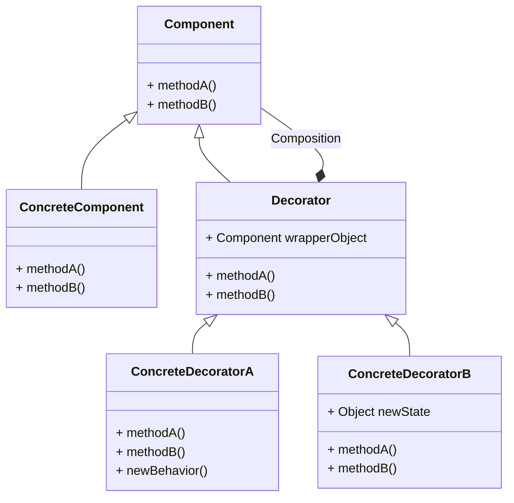

```mermaid
classDiagram
    class Component {
        + methodA()
        + methodB()
    }
    class ConcreteComponent {
        + methodA()
        + methodB()
    }
    class Decorator {
        + Component wrapperObject
        + methodA()
        + methodB()
    }
    class ConcreteDecoratorA {
        + methodA()
        + methodB()
        + newBehavior()
    }
    class ConcreteDecoratorB {
        + Object newState
        + methodA()
        + methodB()
    }

    Component <|-- ConcreteComponent
    Component <|-- Decorator
    Decorator <|-- ConcreteDecoratorA
    Decorator <|-- ConcreteDecoratorB

    Component --* Decorator : Composition  

```